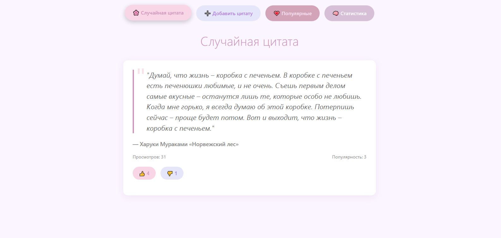
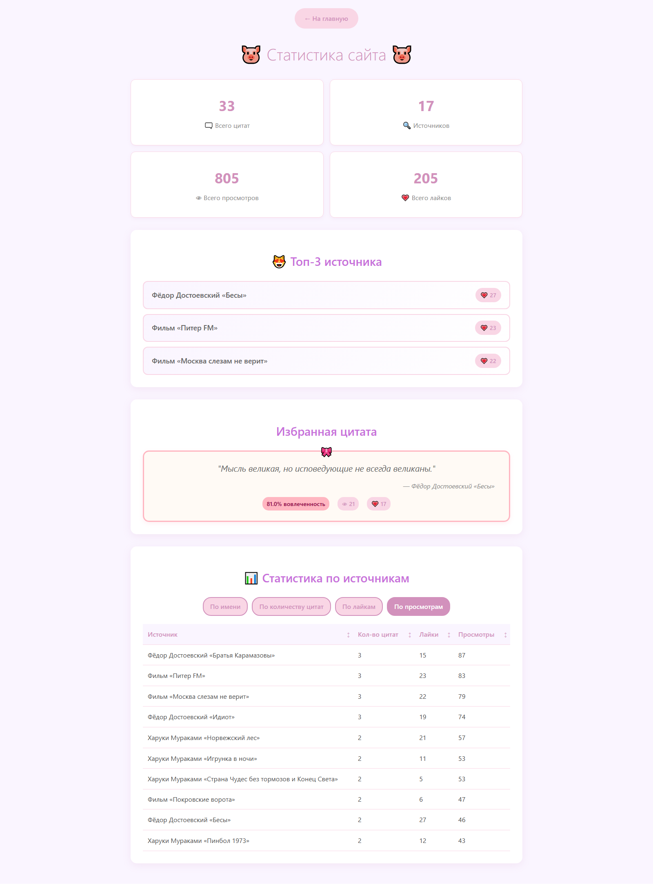
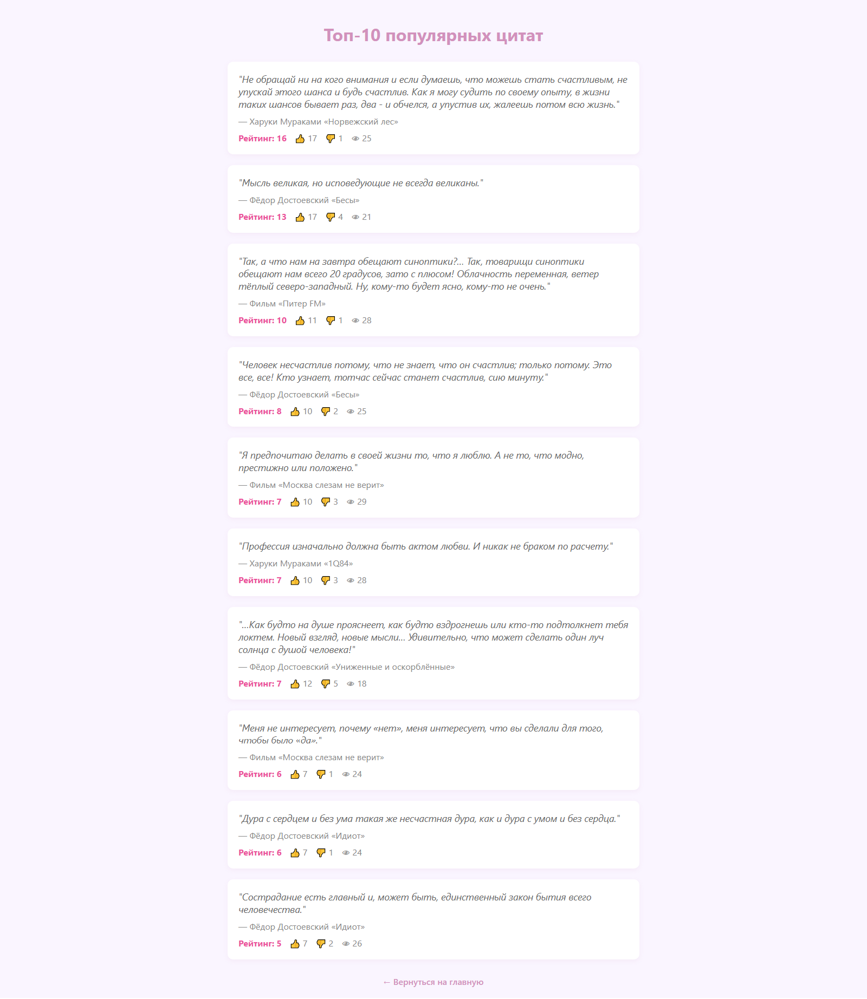
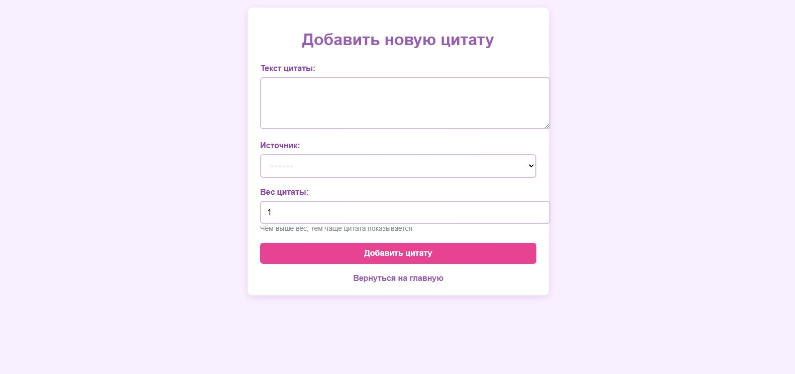

<div align="center">

# 🐷 Цитаты / Quotes Collection
_**Веб-приложение на Django для работы с цитатами, их оценки и анализа статистики**_
</div>

### [Смотреть видео-демонстрацию 🎀](https://disk.yandex.ru/i/FldZ5hq4Ko6Tuw)
### [Открыть сайт 🧠](https://kosu1l1ya.pythonanywhere.com)

__

*Скриншот главной страницы приложения*


__

*Дашборд с аналитикой и сортировкой*


__

*Страница с топ-10 популярных цитат*


__

*Форма добавления новой цитаты*

## ✨ Особенности и функции

| Функция | Описание |
|---------|----------|
| __🧊 Случайная цитата __  | умный подбор цитат по их весу |
| __💗 Оценка цитат __ | лайки и дизлайки для цитат |
| __📊 Статистика__ | анализ популярности и вовлеченности |
| __➕ Простое добавление__ | интуитивная форма добавления новых цитат  |
| __🏆 Топ цитат__ | рейтинг популярных цитат |
| __📈 Dashboard__ | полная аналитика по авторам и цитатам |
|__💎 Ограничения__ | не более 3 цитат на источник |


	
## 🚀 Установка и запуск
 **_Требования:_**
* _Python 3.7+_
* _Django 4.2+_
* _База данных SQLite_

## Пошаговая установка
### 1. Клонируйте репозиторий:
```
git clone https://github.com/kosu1l1ya/quotes_test
cd quotes_test
```
### 2. Создайте виртуальное окружение:
```
python -m venv venv
source venv/bin/activate  # Linux/MacOS
venv\Scripts\activate     # Windows
```
### 3. Установите зависимости:
```
pip install -r requirements.txt
```
### 4. Примените миграции:
```
python manage.py migrate
```
### 5. Измените настройку для локального сервера 🔧 
В файле quotes/settings.py найдите строку:
```
DEBUG = False
```
Измените на:
```
DEBUG = True
```
### 6. Запустите сервер:
```
python manage.py runserver
```
### 7. Откройте в браузере:
```
http://localhost:8000
```
#### ❕ При первом запуске требуется создание суперпользователя для доступа к админке ❕

## 🎯 Как пользоваться

После запуска вы можете:
- **Просматривать** случайные цитаты на главной странице
- **Оценивать** цитаты с помощью лайков/дизлайков
- **Добавлять** новые цитаты через форму (макс. 3 на источник)
- **Анализировать** статистику в разделе Dashboard
- **Сортировать** данные по различным параметрам

### 📊 Система оценок

| Действие | Влияние |
|----------|---------|
| __👍 Лайк__ | __+1__ к популярности |
| __👎 Дизлайк__ | __-1__ к популярности |
| __👁 Просмотр__ | __+1__ к счетчику просмотров |
### 🛠️ Структура проекта
```
quotes/
├── main/                     # Основное приложение
│   ├── migrations/           # Миграции базы данных
│   ├── templates/main/       # HTML шаблоны
│   ├── admin.py              # Админ-панель
│   ├── forms.py              # Формы
│   ├── models.py             # Модели данных
│   ├── urls.py               # Маршруты приложения
│   └── views.py              # Логика приложения
├── quotes/                   # Настройки проекта
│   ├── settings.py           # Конфигурация (здесь меняем DEBUG)
│   ├── urls.py               # Главные URL
│   └── wsgi.py               # Для деплоя
├── manage.py                 # Управление Django
├── requirements.txt          # Зависимости
└── README.md                 # Этот файл

```
### 📦 Технологический стек
- **Backend:** Python, Django
- **Frontend:** HTML, CSS 
- **Database:** SQLite 

## 🔮 Что можно улучшить

- 📄 **Пагинация на дашборде** - постраничный вывод всех авторов
- ⚖️ **Автоматический расчет веса** - динамическое изменение веса по рейтингу  
- 🚀 **Кэширование** - уменьшение нагрузки на базу данных
- 🧪 **Тесты** - покрытие тестами моделей и представлений
- 🌐 **REST API** - API для интеграции с внешними сервисами

**Автор:** [Kosu1l1ya](https://github.com/Kosu1l1ya)  
**Telegram:** [@kosu1l1ya](https://t.me/kosu1l1ya) 
